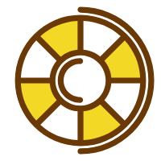

# EchoWheel UI 

## 👀 介绍

EchoWheel UI 是一个不太一样的 UI 框架。

本 UI 框架是一个「面向源码阅读者」的框架。如果对你有帮助，请不要吝惜你的 star。

也就是说，我制作这个框架的目的就是让前端小伙伴一起学习轮子的制作思路。所有代码都追求可读性。

每个分支名称代表完成组件名，目前提交顺序是

> `button-and-input` -> `row-and-col` -> `grid-and-layout` -> `toast` -> `tabs` -> `popover` -> `collapse` -> `cascader` -> `slides` -> `nav` -> `validate` -> `page` -> `table` -> `uploader` -> `sticky` -> `date-picker` -> `scroll`

可按照此顺序查看分支以获得具体组件完成时的提交记录，按此学习编写组件的源代码。

如果你对代码有疑问，欢迎[提issue](https://github.com/zyqq/wheel/issues)，我会回答你的疑问。

也欢迎一起来造轮子 😊

本 UI 框架是基于 Vue 2 实现的。

注意：本 UI 框架的代码尚已完工，但是主要目的在于供学习参考，因此不保证代码健全性，请不要在生产环境中使用本 UI 框架。

## 🔥 你能学到什么

1. 单元测试、覆盖率、持续集成等工程概念
2. 重构、TDD/BDD、设计模式、单向数据流等技术概念
3. Vue 的几乎所有功能，并且是深入理解这些功能，而不是肤浅理解

## 🍳 有哪些轮子

* 简单轮子：按钮（Button）、输入框（Input）、网格（Grid）、布局(Layout)、提示（Toast）、标签页（Tabs）、弹出层（Popover）、折叠面板（Collapse）
* 进阶轮子：级联选择（Cascader）、无缝轮播（Slides）、响应式导航条（Nav）、分页(Pager)、表单验证（Validate）、图片上传（Uploader）、粘滞组件（Sticky）
* 高级轮子：滚动条（Scroll）、日期选择器（DatePicker）、表格（Table）

## 📌 项目特点

1. 使用 Travis CI 进行持续集成
2. 有丰富的单元测试，项目完成时，期望测试覆盖率超过 90%
3. 自说明的代码，即使没有注释，你也能看懂
4. 初期我使用 parcel 构建方便新人上手，后期改为 Vue Cli 3 以实现更多功能

## 🔮 视觉稿

本 UI 框架借鉴了一些成熟 UI 框架（如 Framework7、Element UI 和 Ant Design）的外观，[视觉稿](https://www.yuque.com/u29422/gulu/artboards/22283)。

## 🚲 为什么叫 EchoWheel UI

因为Wheel就是「轮子」的意思，Echo则是本人英文名。

## 📚 源码学习

1. 安装依赖

    ```js
    yarn install
    ```

2. 启动 dev server

    ```js
    yarn serve
    ```

## 📞 个人交流公众号

搜索微信号Echo_252545095或者秋博士或者扫描以下二维码添加本人公众号😄
<a href="https://github.com/zyqq/wheel/graphs/contributors">
  
</a>
